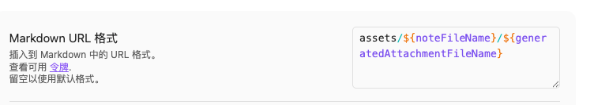
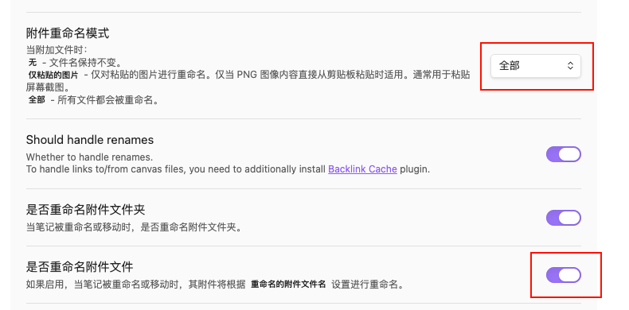
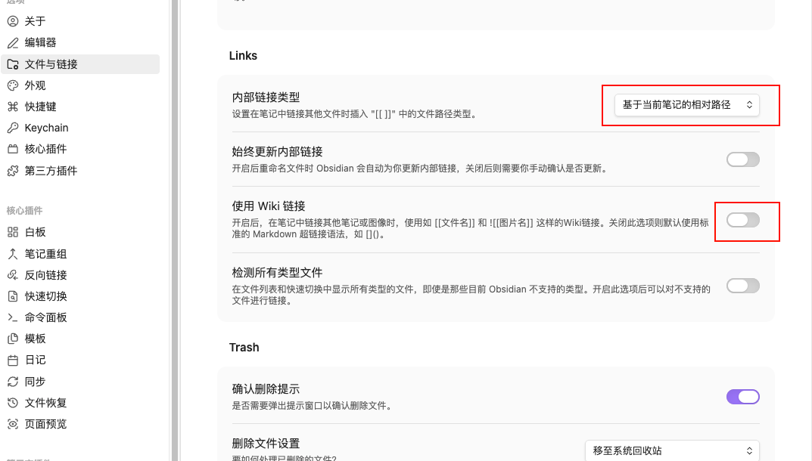

## 地址1

https://obsidian.md/

## 排除文件

根目录新建 .gitignore 文件

```
.obsidian/workspace.json
.obsidian/workspace-mobile.json
```

## 自动同步

- 设置-第三方插件-关闭安全模式-社区插件市场
- 安装插件 Git
  - 启动
  - 设置自动同步以及同步时间
  - 设置启动时自动 Pull

## 图片使用

- 安装插件 Custom Attach Location
- 修改配置








